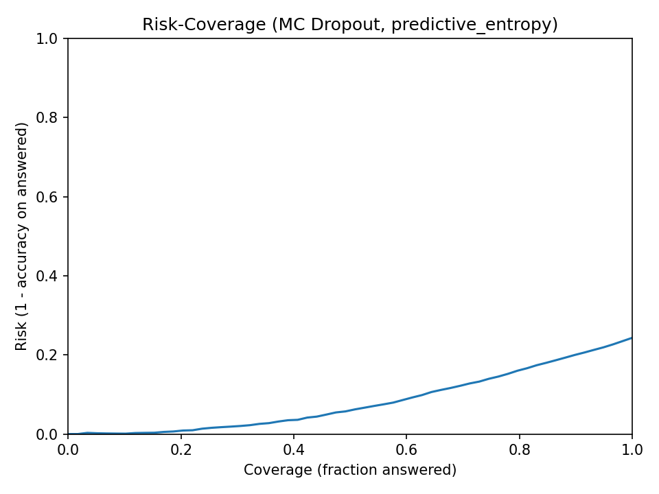
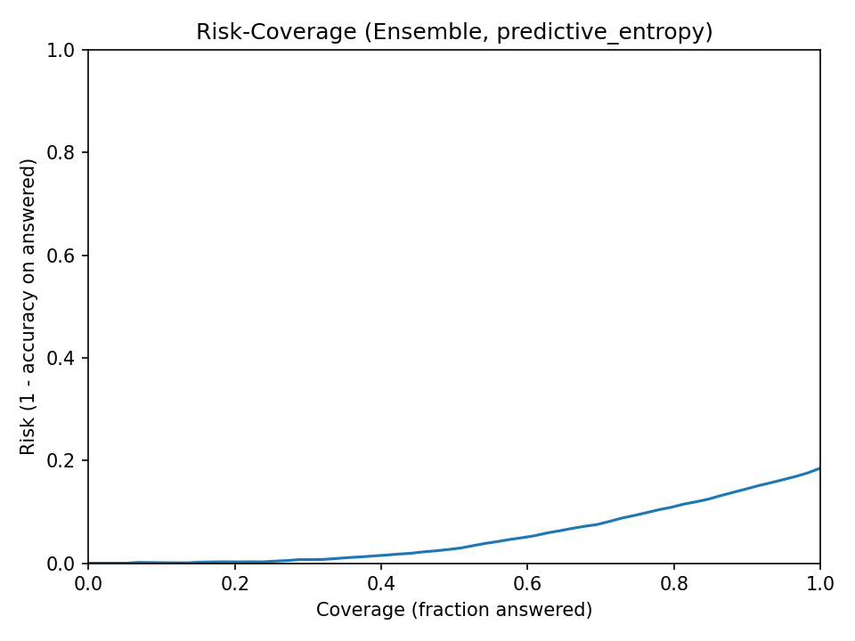
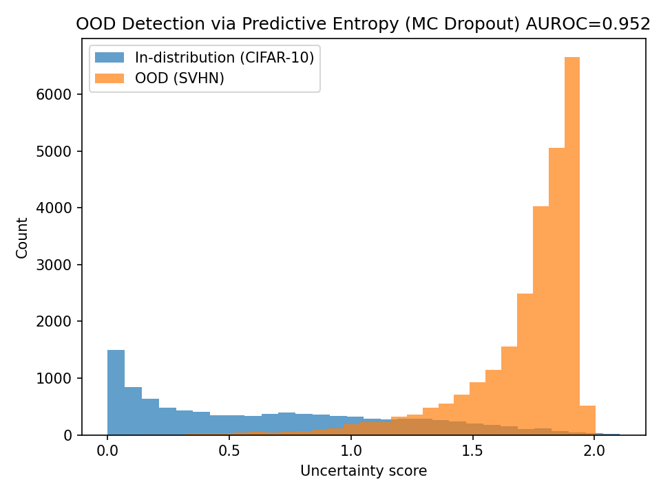

# Uncertainty-First ML: Self-Aware Decision Engine

A **self-aware machine learning system** that not only predicts, but **knows when it does not know**.

This project implements uncertainty estimation, calibration, abstention (“I don’t know”), and out-of-distribution (OOD) detection, and evaluates them rigorously under distribution shift.

---

## Why this project exists

Most machine learning models **always produce an answer**, even when they are wrong or uncertain.  
In real-world, high-stakes settings (healthcare, agriculture, autonomous systems), this behavior is dangerous.

This project explores an alternative paradigm:

> **A model should refuse to answer when uncertainty is high.**

Instead of optimizing accuracy alone, this system focuses on:
- reliability
- calibrated confidence
- explicit uncertainty
- failure awareness under distribution shift

---

## What makes this system *self-aware*?

This system can **abstain** from making a prediction when uncertainty exceeds a threshold.

It includes:
- **Uncertainty estimation**
  - MC Dropout
  - Deep Ensembles
- **Calibration diagnostics**
  - Reliability diagrams
  - Expected Calibration Error (ECE)
- **Abstention analysis**
  - Risk–coverage curves
  - Coverage at target accuracy (e.g., 95%)
- **OOD detection**
  - Predictive entropy
  - AUROC on CIFAR-10 (ID) vs SVHN (OOD)

---

## Methods implemented

- Baseline CNN / ResNet classifier
- MC Dropout (Bayesian approximation)
- Deep Ensembles (multiple independently trained models)
- Predictive entropy & max-probability uncertainty
- Risk–coverage evaluation
- OOD evaluation with AUROC, ROC curves, and histograms
- Fully reproducible, config-driven experiments

---

## Key plots

### Risk–Coverage (Abstention)
Deep ensembles answer **more samples** while maintaining **95% accuracy**, demonstrating stronger uncertainty awareness.




---

### OOD detection (CIFAR-10 vs SVHN)
Predictive entropy cleanly separates in-distribution and OOD samples.




---

## Results (CIFAR-10 ID + SVHN OOD)

| Method | ID Accuracy (CIFAR-10) | ECE ↓ | OOD AUROC ↑ | Coverage @ 95% Accuracy ↑ |
|------|------------------------:|------:|-------------:|--------------------------:|
| MC Dropout (20 passes) | 0.733 | 0.0378 | 0.9320 | 0.432 |
| Deep Ensemble (5 models) | 0.758 | 0.0694 | 0.9341 | 0.594 |

**Interpretation**
- Deep ensembles provide **much higher usable coverage** at high accuracy.
- MC Dropout offers slightly better calibration in this setup.
- Both methods detect OOD data reliably.

---

## Project structure

uncertainty-first-ml/
src/
data/
models/
uncertainty/
calibration/
evaluation/
utils/
experiments/
configs/
runs/
app/
reports/
notebooks/
tests/
assets/


---

## Reproducibility

All experiments are **fully reproducible** using YAML config files.

### MC Dropout
```bash
python -m src.train --config experiments/configs/mc_dropout.yaml

Deep Ensemble
python -m src.train --config experiments/configs/ensemble.yaml
